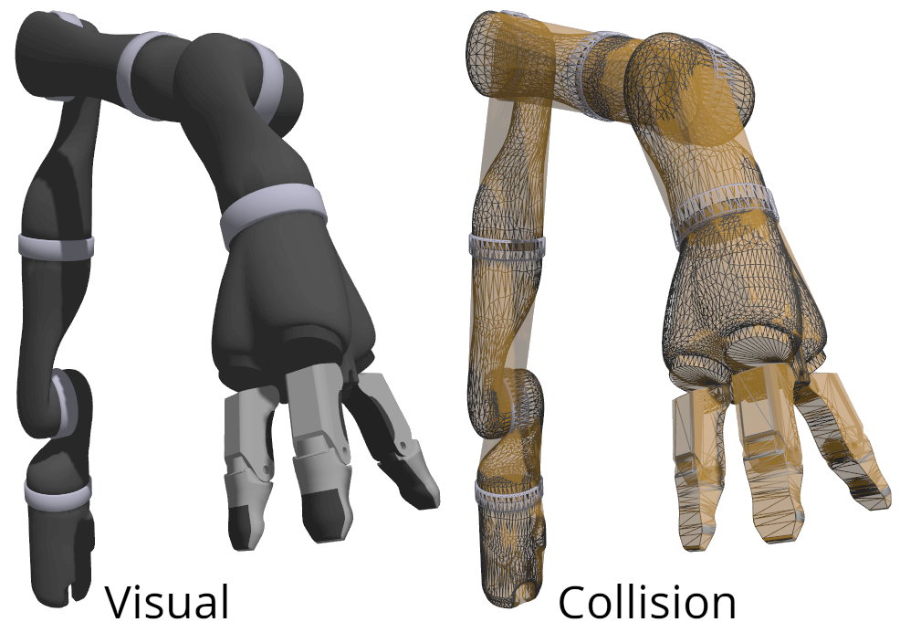

# kinova_j2s7s300_ign

URDF and SDF descriptions of Kinova Gen2 robot (j2s7s300) compatible with Ignition and MoveIt2.


This model uses a simplified visual and collision geometry compared to the official [kinova-ros](https://github.com/Kinovarobotics/kinova-ros). Collisions geometry is currently a low-res convex hull, but it might be remodelled manually in the future in order to provide a more efficient representation.

The SDF description also contains estimated **dynamic parameters** for joints. Note that these values are NOT based on real-life robot and should therefore be used with caution.

## Instructions

### ROS 2 (Optional)

Build with `colcon` and source the environment to make URDF discoverable for ROS 2.

### Ignition

Export `IGN_GAZEBO_RESOURCE_PATH` to make SDF discoverable within the context of Ignition Gazebo.

```bash
export IGN_GAZEBO_RESOURCE_PATH=${PARENT_DIR}/kinova_j2s7s300_ign:${IGN_GAZEBO_RESOURCE_PATH}
```

Alternatively, you can just include the model from [Ignition Fuel](https://app.ignitionrobotics.org/AndrejOrsula/fuel/models/kinova_j2s7s300) if you do not require the URDF description (or you use it from the official [kinova-ros](https://github.com/Kinovarobotics/kinova-ros)).

```xml
<include>
    <uri>https://fuel.ignitionrobotics.org/1.0/AndrejOrsula/models/kinova_j2s7s300</uri>
</include>
```

## Directory Structure

```bash
kinova_j2s7s300_ign
├── kinova_j2s7s300          # Model directory compatible with Ignition Fuel
    ├─ meshes                # Meshes for both SDF and URDF
        ├── collision        # STL files for collision detection
            └─ *.stl
        └── visual           # COLLADA files for visuals
            └─ *.dae
    ├─ thumbnails            # Thumbnails for Fuel
        └─ *.png
    ├── model.config         # Ignition model meta data
    └── model.sdf            # SDF description of the Ignition model
├── urdf
    └── kinova_j2s7s300.urdf # URDF description of the model for MoveIt2
├── CMakeLists.txt
└── package.xml              # ROS2 kinova_j2s7s300 description package `kinova_j2s7s300_ign`
```
